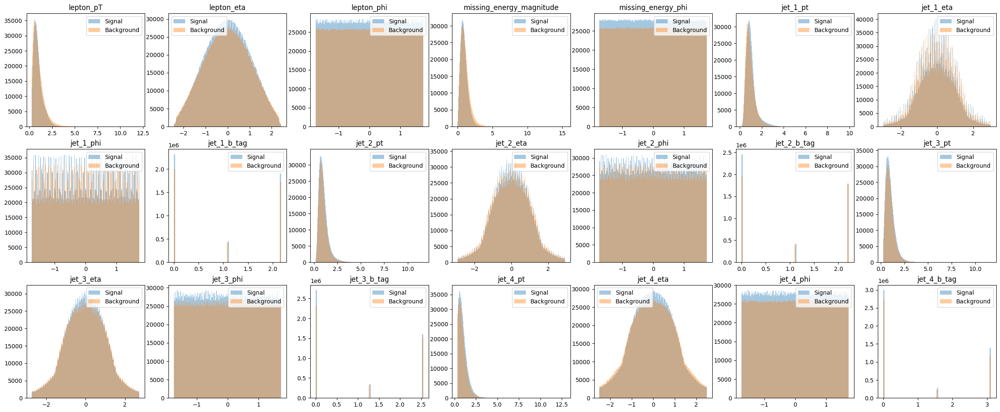
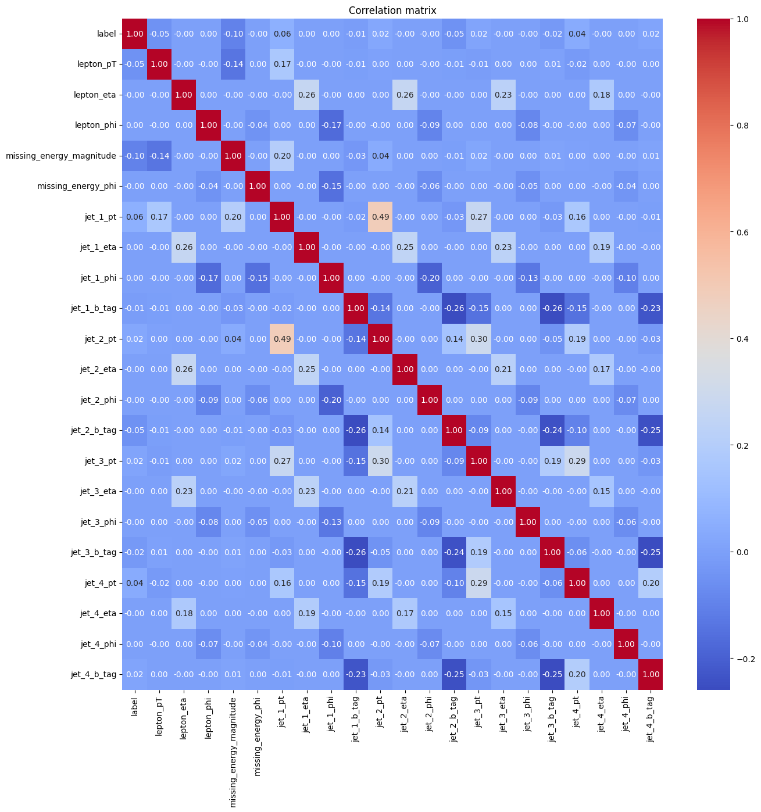
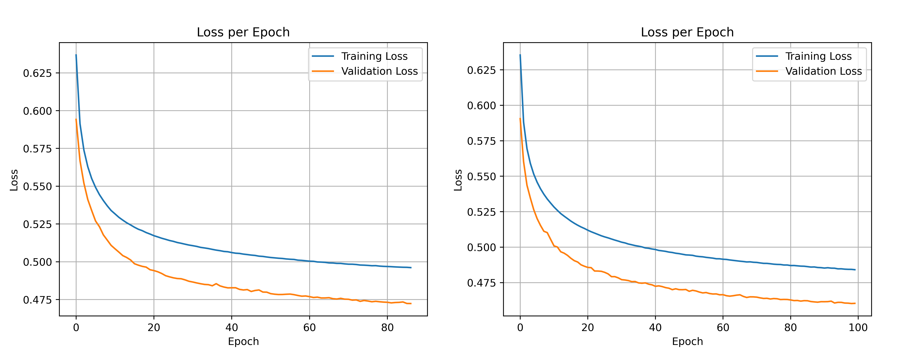
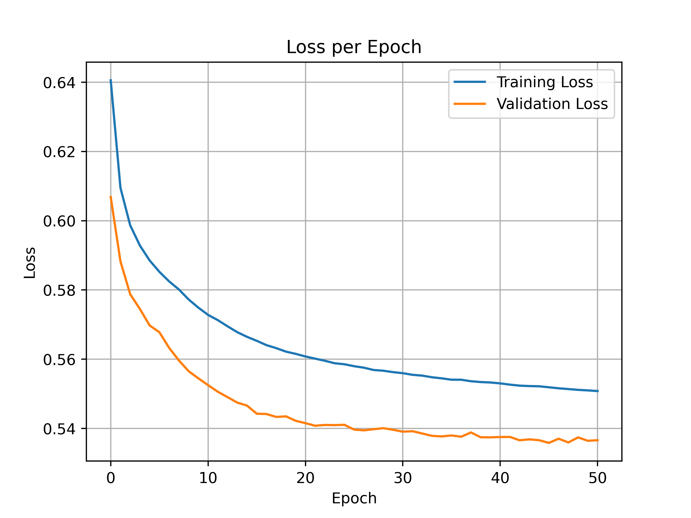
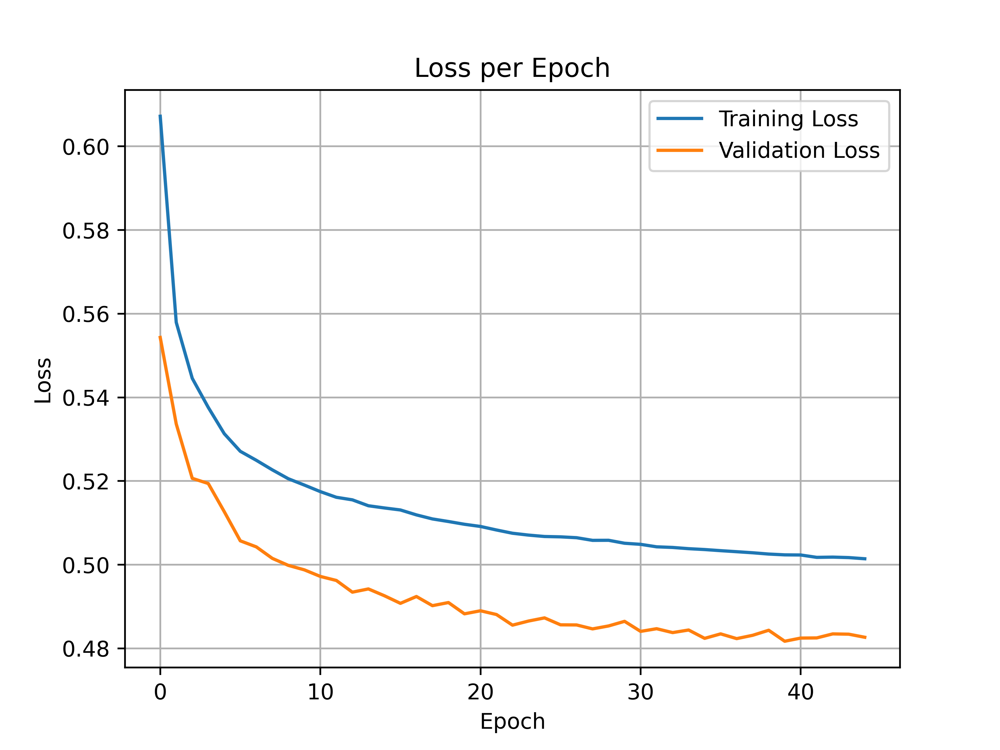
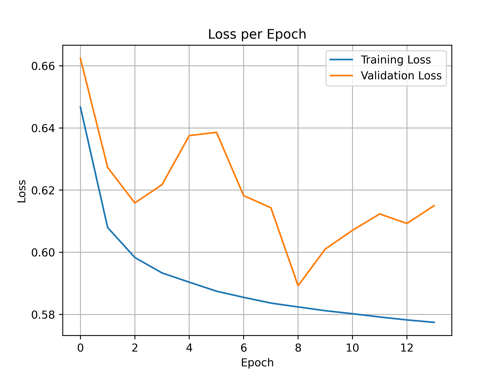

<!-- omit from toc -->
# A Machine Learning application to the HIGGS binary classification

The goal of this project is to develop a python script capable of processing a dataset, splitting it into train and test, and then automatically training and saving multiple neural networks model-either multilayer perceptron (MLP) or convolution neural network (CNN)-given their specifications in a configuration file. Afterward, a second script will use the trained models to make predictions on the test set, save them and display the relevant performance metrics. 

To show how the code can be used, we will tests various neural network models to address a binary classification task (signal vs. background) using the [HIGGS](https://archive.ics.uci.edu/dataset/280/higgs) dataset, which contains 11 million of simulated events.


<!-- omit from toc -->
## Table of contents

- [Requirements](#requirements)
- [The HIGGS classification problem](#the-higgs-classification-problem)
  - [Data exploration](#data-exploration)
  - [The models](#the-models)
  - [The Training](#the-training)
    - [MLPs on the low level features](#mlps-on-the-low-level-features)
    - [MLP on both low-level and high-level features](#mlp-on-both-low-level-and-high-level-features)
    - [CNN on the lo-level features](#cnn-on-the-lo-level-features)
  - [Results on the test dataset](#results-on-the-test-dataset)
    - [`MLP_21ft_4l`](#mlp_21ft_4l-1)
    - [`MLP_21ft_3l`](#mlp_21ft_3l-1)
    - [`MLP_21ft_3l_larger`](#mlp_21ft_3l_larger-1)
    - [`MLP_28ft`](#mlp_28ft-1)
    - [`CNN_21ft`](#cnn_21ft-1)
  - [Summary of accuracy and AUC](#summary-of-accuracy-and-auc)
- [The Code](#the-code)
  - [The Configuration File (config.yaml)](#the-configuration-file-configyaml)
  - [The train.py](#the-trainpy)
  - [The test.py](#the-testpy)
- [Conclusions](#conclusions)

## Requirements

This project requires **Python 3.11.13 or later** and the following Python packages:

- `matplotlib`
- `numpy`
- `pandas`
- `pydantic` (V2)
- `scikit-learn`
- `pyYAML`
- `tensorflow>=2.16`
<!-- omit from toc -->
### Creating a new environment

It is recommended to create a dedicated environment to avoid conflicts with other packages. We recommend using [Anaconda](https://www.anaconda.com/docs/getting-started/anaconda/install), which simplifies packages installation and [environment management](https://docs.conda.io/projects/conda/en/latest/user-guide/tasks/manage-environments.html).

Once the dedicated environment has been created, the requirements can be installed by simply running:

```bash
$ pip install -r requirements.txt
```

To clone the repository locally:

```bash
$ git clone https://github.com/martagrenno/SC_exam_HiGGS_MachineLearning.git
---

## The HIGGS classification problem


The HIGGS dataset is a binary classification benchmark distinguishing signal from background events using a collection of kinematic and high-level features. In particular this data set is a simulated data. Simulated events are generated with the madgraph5  event generator assuming 8 TeV collisions
of protons as at the latest run of the Large Hadron Collider, with showering and hadronization performed
by Pythia and detector response simulated by Delphes.

In the data set the first column is the binary label and the following 28 columns are numerical features. The first 21 features (columns 2-22) are kinematic properties measured by the particle detectors in the accelerator. The last seven features are functions of the first 21 features; these are high-level features derived by physicists to help discriminate between the two classes. 
The low-level features show some distinguishing characteristics, but our knowledge of the different intermediate states of the two processes allows us to construct other features which better capture the differences.


### Data exploration

The figure below shows the distribution of the **28 features** used to train the machine learning model.  
Each subplot corresponds to a physical variable (e.g. transverse momentum `pT`, pseudorapidity `eta`, angle `phi`, b-tagging, etc.) and compares the values for **signal** (blue) and **background** (orange).




- From these overlapping histograms of the feautures we can say that there is not a clear difference between background and signal.
- Some variables (e.g. `jet_b_tag`) show some differences between signal and background, making them more discriminative.  
- Other variables (e.g. `eta`, `phi`) look more similar, meaning they are less powerful on their own, but still valuable when combined in the model.  


In this second figure below we can see the **correlation matrix** of all input features used in the machine learning model.  
Each entry quantifies the linear correlation between two variables, with values ranging from **-1** (perfect anti-correlation) to **+1** (perfect correlation).  




- Most features exhibit **low pairwise correlations**, suggesting that they provide complementary information to the classifier.  
- Some moderate correlations are observed, for instance between **jet transverse momenta** (e.g. `jet_1_pt` and `jet_2_pt`), which is expected due to event kinematics.  
- The **b-tagging scores** appear largely uncorrelated with other kinematic variables, confirming their role as independent discriminants.  
- The correlation matrix is a valuable diagnostic tool for identifying **redundant features** that may not add significant information, and for ensuring that the model does not rely excessively on highly correlated variables.  


### The models

Here, we report the architectures of the models used to make predictions on the HIGGS dataset. For further details on their configurations and the performance achieved, please refer to the following sections.

- **Features**: 1-21, only the low level features
- **Number of epochs**: 100 (limited by our hardware)
- **Learning rate**: 0.001
- **Early stop patience**: 5
- **Validation size**: 0.2
<!-- omit from toc -->
#### MLP_21ft_3l

1. Dense(1024, ReLU) + Dropout(0.3)
2. Dense(512, ReLU) + Dropout(0.2)
3. Dense(256, ReLU) + Dropout(0.2)
4. Dense(1, Sigmoid)
<!-- omit from toc -->
#### MLP_21ft_4l

1. Dense(1024, ReLU) + Dropout(0.3)
2. Dense(1024, ReLU) + Dropout(0.3)
3. Dense(512, ReLU) + Dropout(0.2)
4. Dense(128, ReLU) + Dropout(0.2)
5. Dense(1, Sigmoid)
<!-- omit from toc -->
#### MLP_21ft_3l_larger

- **Learning rate**: 0.003

1. Dense(2048, ReLU) + Dropout(0.3)
2. Dense(512, ReLU) + Dropout(0.2)
3. Dense(256, ReLU) + Dropout(0.2)
4. Dense(1, Sigmoid)
<!-- omit from toc -->

<!-- omit from toc -->
#### MLP_28ft

For this model we changed only the **used features** to 1-28, in order to include both the low level and the high level features.

1. Dense(512, ReLU) + Dropout(0.3)
2. Dense(256, ReLU) + Dropout(0.2)
3. Dense(128, ReLU) + Dropout(0.2)
4. Dense(1, Sigmoid)
<!-- omit from toc -->
#### CNN_21ft

- Convolution stack:
  1. Conv1D(filters=128, kernel_size=5)
  2. Conv1D(filters=64, kernel_size=5)
- Dense head:
  1. Dense(512, ReLU) + Dropout(0.3)
  2. Dense(256, ReLU) + Dropout(0.2)
  3. Dense(1, Sigmoid)


### The Training

#### MLPs on the low level features

We started by working on the database by using the first 21 features only, which are the low level features. As a first step we tried two different MLP, with 3 and 4 fully connected (Dense) layers, namely [`MLP_21ft_3l`](#mlp_21ft_3l) and [`MLP_21ft_4l`](mlp_21ft_4l). Both models consist of fully connected layers with the ReLU activation function. We chose ReLU because it generally provides greater stability when training deep neural networks. The number of neurons was arranged in an inverted-pyramid fashion: the early layers capture low-level or raw patterns from the input features, while the deeper layers combine them into increasingly abstract and high-level representations. Since abstract concepts often require fewer dimensions to be expressed, the number of neurons can be progressively reduced in the later layers. 

For both the models, we report the metrics we obtained  on the validation set in the table below, alongside with the loss graph per epoch

| Metric | `MLP_21ft_3l`  | `MLP_21ft_4l` |
| -------| ------------- | ------------- |
| Validation loss| 0.47 |0.46 |
| Validation accuracy| 0.77 |0.78  |
| Validation AUC | 0.85 |0.86 |

|Loss per epoch `MLP_21ft_3l` and `MLP_21ft_4l`|
|---|

*Right validation loos per epoch for `MLP_21ft_3l`, left validation loss per epoch for `MLP_21ft_4l`*


As we can see, despite requiring twice the training time, the four-layers model achieved only a marginal improvement in the metrics. Furthermore, from the graph, we notice that neither model reach a plateau. This suggested us that, over 100 epochs, increasing the number of layers does not necessary lead to performance gains.
Given this, we hypothesized that the model need a richer low-level representation. Thus we designed a third model ([`MLP_21ft_3l_larger`](#mlp_21ft_3l_larger)) with three layers in which the first layer was larger than in the previous trained 3-layers model. The increase in the first layer size is intended to potentially allow the network to capture more complex interactions and correlations between the input features.  

The metrics on the validation set are reported in the table below, and the loos per epoch in the graph below:

| Metric | `MLP_21ft_3l_larger`|
| -------| ------------- |
| Validation loss| 0.53 |
| Validation accuracy| 0.73 |
| Validation AUC | 0.80 |

|Loss per epoch `MLP_21ft_3l_larger`|
|---|

*Validation loos per epoch for `MLP_21ft_3l_larger`*

Furthermore since the plateau was not reached in the previous trial, we increased the learning speed from 0.001 to 0.003.
We observe that the metrics are remarkably worst than both those of `MPL_21ft_3l` and `MLP_21ft_4l`, triggering the early stop at epoch 50. This result, in combination with the previous finding, suggests that network performance does not increase linearly with depth or the number of neurons. Therefore, for further improving we should focus on fine-tuning the activation functions and layer dimensions, as well as increasing the number of training epochs to achieve the best possible loss and accuracy. Unfortunately, we were limited by the available hardware and could not extend the number of epochs, which would have been necessary for this final step.


#### MLP on both low-level and high-level features

Then we moved to consider the whole dataset composed of both low-level and high-level features. Since the high-level features are calculated by physicists because they are particularly relevant for the HIGGS boson identification, we wanted to test if a neural network is capable of grasping this higher importance. Thus we decided to use a three-layers MLP ([`MLP_28ft`](#mlp_28ft)), with fewer neurons per layers, given the seven high-level more significant features, the network was expected to achieve performance similar to the previous models despite the reduced layer sizes.

| Metric | `MLP_28ft`|
| -------| ------------- |
| Validation loss| 0.48 |
| Validation accuracy| 0.76 |
| Validation AUC | 0.85 |

| Loss per epoch `MLP_28ft` |
| --- |

*Validation loos per epoch for `MLP_28ft`*

As we expected, the metrics are comparable with the results that we obtained with the first two models despite the reduced dimensions. We also emphasize that a single training epoch was approximately six times faster than that of the 4-layer model `MLP_21ft_4l`, demonstrating a significant improvement in computational efficiency.

#### CNN on the low-level features

As a final experiment, we tested how a CNN on this binary classification task. CNNs are particularly effective at recognizing local patterns, which is why they are widely used for image recognition and time-series analysis.
Although the HIGGS dataset is tabular, we decided to test whether a CNN could capture local interactions among the features. By treating the input features as a one-dimensional sequence, 1D convolutional layers can detect interactions between nearby features. So we built the model [`CNN_21ft`](#cnn_21ft), consisting of two convolution layers followed by a two-layers MLP, which combines the relations learned by the convolutional layers to produce the final predictions.

The metrics on the validation set are reported in the table below, and the loss per epoch in the graph below:

| Metric | `CNN_21ft`|
| -------| ------------- |
| Validation loss| 0.59 |
| Validation accuracy| 0.70 |
| Validation AUC | 0.77 |

| Loss per epoch `CNN_21ft` |
| --- |

*Validation loos per epoch for `CNN_21ft`*

As expected the CNN did not perform well. Indeed the program stopped the learning because the validation loss, as visible in the graph, began to increase rapidly. This makes it difficult to trust the obtained accuracy and loss, as the reduction observed between epochs 5 and 8 might be due to random fluctuations. However, it is interesting to note that the problem seems to be overfitting: while the training loss continued to decrease, the validation loss increased. This indicates that the model is actually learning patterns from the training data. For future work, it could be valuable to introduce dropout between the convolutional layers to reduce overfitting and potentially enable the CNN to produce reliable predictions.

### Results on the test dataset

All trained models were evaluated on the previously held-out test dataset. The performance metrics for each model (precision, recall, and F1-score) are summarized in the tables below.
Since the HIGGS dataset is simulated and nearly noise-free, we do not expect substantial differences between validation and test performance. Accordingly, our initial expectation was that the `MLP_21ft_3l`, `MLP_21ft_4l` and `MLP_28ft` models would achieve the best results.

We showcase the metrics in the tables below:

#### `MLP_21ft_4l`

| Class  | Precision | Recall | F1-Score |
|--------|-----------|--------|----------|
| 0.0    | 0.78      | 0.74   | 0.76     |
| 1.0    | 0.78      | 0.81   | 0.80     |

#### `MLP_21ft_3l`

| Class  | Precision | Recall | F1-Score |
|--------|-----------|--------|----------|
| 0.0    | 0.77      | 0.73   | 0.75     |
| 1.0    | 0.77      | 0.81   | 0.79     |

#### `MLP_21ft_3l_larger`

| Class  | Precision | Recall | F1-Score |
|--------|-----------|--------|----------|
| 0.0    | 0.74      | 0.65   | 0.69     |
| 1.0    | 0.72      | 0.79   | 0.76     |

#### `MLP_28ft`

| Class  | Precision | Recall | F1-Score |
|--------|-----------|--------|----------|
| 0.0    | 0.75      | 0.74   | 0.75     |
| 1.0    | 0.77      | 0.78   | 0.78     |

#### `CNN_21ft`

| Class  | Precision | Recall | F1-Score |
|--------|-----------|--------|----------|
| 0.0    | 0.69      | 0.66   | 0.67     |
| 1.0    | 0.71      | 0.73   | 0.72     |


### Summary of accuracy and AUC 

|Model| Accuracy | AUC |
|---|---| ---|
|`MLP_21ft_4l`|0.78|0.85|
|`MLP_21ft_3l`|0.77|0.86|
|`MLP_21ft_3l_larger`|0.73 |0.80|
|`MLP_28ft`|0.76|0.85|
| `CNN_21ft` |0.80|0.77|


The `MLP_21ft_4l` model achieved the highest overall performance, with F1-scores of 0.76 and 0.80 for classes 0 and 1, respectively. The slightly smaller `MLP_21ft_3l` model showed comparable results, indicating that reducing the number of layers from four to three does not substantially degrade performance.
The `MLP_28ft` model, which includes both low-level and high-level features, achieved performance similar to the first two models. This confirms our expectations based on the validation results: incorporating high-level features enables accurate predictions even with smaller, faster models.
Finally the `CNN_21ft` model showed the lowest metrics across all models. However, as previously mentioned, it suffered from overfitting, addressing this issue could potentially allow it to reach performance comparable to the MLPs.
For a complete overview of the perfomance of this work, it is possible to examinate teh confusion matrix and roc curve in the  [Results](Results/) folder.


## The Code

In this section, we describe in detail how the code works: how models are built, trained, and tested, as well as how they can be configured.

The project revolves around two entry points, `train.py` for training and `test.py` for evaluation, the class and functions used by the two codes are contained in the folder [include](Include/). Typically one run `train.py` once to produce saved `.keras` models and then run `test.py` to generate predictions, plots and metrics on the held-out test data. The architecture and hyperparameters of the neural networks are specified in the `config.yaml` file, which allows flexible model configuration without modifying the codebase. Moreover, if multiple models are defined in the configuration file,  both `train.py` and `test.py` are able to handle them sequentially, saving each trained model and evaluating all of them in turn.

### The Configuration File (config.yaml)

The `config.yaml` file is structured into two main sections: **global settings** and **model parameters**.

<!-- omit from toc -->
#### Global Settings

These parameters apply to all models:

- `input_file_path`: path to the dataset.  
- `test_size`: fraction of the dataset reserved for testing.  
- `seed`: random seed to ensure reproducibility.
- `class_labels`: labels for the two target classes.

<!-- omit from toc -->
#### Model Parameters

The `model_parameters` section is a list where each entry corresponds to a different model to be trained.  
For each model, the following parameters are defined:

- `name`: identifier of the model.  
- `epochs`: maximum number of training epochs.  
- `batch_size`: number of samples processed per gradient update.  
- `learning_rate`: initial learning rate for the optimizer.  
- `early_stop_patience`: number of epochs without improvement before early stopping.  
- `lr_plateau_reduction_patience`: patience parameter for learning rate reduction on plateau.  
- `validation_size`: fraction of the training set used for validation.  
- `use_features`: range of features from the dataset to be used.

Additional parameters are model-specific:

- For **MLPs**, `hidden_layers` and `dropout_layers` are required.
- For **CNNs**, `conv_layers` (number of filters and kernel size per layer) and `conv_pool_size` (average pooling size to reduce dimensionality) are required.
- If **both CNN and MLP parameters** are provided, the resulting architecture has the convolutional layers (with their pooling) first, followed by the fully connected dense layers (with their dropout).

<!-- omit from toc -->
#### Example

A hybrid model with:

```yaml
conv_layers=[[44, 2], [22, 2]]
conv_pool_size=[2, 0]
hidden_layers=[512, 256]
dropout_layers=[0.3, 0.2]
```

produce a network structured as:

**Conv(44,2) → Pool(2) → Conv(22,2) → Dense(512) → Dropout(0.3) → Dense(256) → Dropout(0.2)**.

<!-- omit from toc -->
#### Important Notes

- The dataset must be provided as a **CSV file**.  
- **Column names are ignored**: only column indices are used.  
- The **first column (index 0)** must always represent the target label.  
- It is possible to set `epochs=0`, in this case, the model will not be trained. This setting acts as a comment-like placeholder in the config file.
- The `use_features` can be provided as:  
  - A list of indices, e.g. `[1, 2, 9]`;
  - A range or combination of ranges, expressed as a string, e.g. `"1-3, 9-25"`.
  

We underline that different models can be trained on different subsets of the available features, as defined in the `use_features` field of the configuration file. Each model carries its own epochs, batch size, learning rate, early stopping settings and validation split. The configuration is parsed and validated with **Pydantic** ([`config_loader.py`](Include/config_loader.py)). If a value is inconsistent, the program reports a validation error before training starts.

### The train.py

`train.py` automates the entire pipeline and training: it validates configuration, handles dataset preparation, dynamically builds neural networks according to model-specific parameters, manages training with appropriate validation splits, and organizes results into structured output folders. We can run the code by simply typing:

```bash
$ python train.py
```

More specifically, `train.py` performs the following steps in order:

1. Reads the `config.yaml` file, and validates the inputs.
2. Loads the datasets:
    - If both `train.csv` and `test.csv` are present, it loads them directly.
    - Otherwise, it reads the input dataset specified in the configuration,normalize its feautures, splits it into training and testing sets, and saves them as `train.csv` and `test.csv`;
3. Prepares the train/validation split according to each model’s `validation_size` parameter.
4. Builds and trains each neural network defined in the configuration, one at a time.
5. Saves the trained models as `.keras` files in the `Model_outputs` folder, along with plots of loss, accuracy, and ROC curves generated during training.

Models configured with epochs=0 are intentionally skipped; a readable warning is emitted to make this explicit while still keeping the pipeline running.

<!-- omit from toc -->
#### Notes on Model Architecture

- If `conv_layers` is **not specified**, the system builds a **multi-layer perceptron (MLP)** composed of fully connected (`Dense`) layers. After each dense layer, a `Dropout` layer is added. If no dropout is desired, set the entries of `dropout_layers` to `0` in `config.yaml`.

- If `conv_layers` **is specified**, the model is built as follows:  
  1. **Convolutional part**, a a series of:
     - Convolutional layer;
     - Normalization layer;
     - Max Pooling layer (if specified);
  2. **Dense layers with dropout**, following the same rules as in the MLP case.  

All convolutional and dense layers use **ReLU** as the activation function.  
The final layer is always a layer with a single neuron and a **sigmoid** activation function, this ensures that the output values are mapped between 0 and 1, which is required for binary classification problems.  

### The test.py

Finally once the `train.py` has been run, we can apply the trained models to makes predictions on the test set. This is done by running `test.py` with the following command:

```bash
$ python test.py
```

`test.py` performs the following steps:

1. Reads the `config.yaml`. This must be the **same exact file** used for the training, ensure this requirement is user's responsibility;
2. Loads the file `test.csv`,if missing the script raises an error;
3. Loads the trained models in `.keras` files, previously produced by `train.py`;
4. Makes the predictions on `test.csv`, and saves the results as a `.csv` with columns:
    - The true target value;
    - The predicted probabilities;
    - The predicted class (calculated using a 0.5 threshold on the sigmoid output);
5. Generates confusion matrices and ROC curves, saving them as a `.png` files.


## Conclusions

In this project, we developed a configurable Python pipeline for training and evaluating neural networks on the HIGGS dataset, including both multilayer perceptrons (MLPs) and a convolutional neural network (CNN). The system allows flexible specification of architectures, hyperparameters, and feature subsets via a single configuration file, enabling efficient experimentation without modifying the codebase.

Our tests show that fully connected MLPs outperform the CNN in this tabular classification task. Moderate-depth networks, such as `MLP_21ft_3l` and `MLP_21ft_4l`, are sufficient to capture the relevant patterns in the data.
Including high-level features with the model `MLP_28ft` allows to achieve comparable performance while significantly reducing computational cost. The CNN, although capable of learning, suffered from overfitting and underperformed compared to the MLPs, highlighting that convolutional architectures are less suited for purely tabular data.

We saw that increasing depth or neuron count does not guarantee better performance, this emphasize the importance of selecting appropriate architectures and fine-tune hyperparameters. Future work could focus on improving CNN performance via regularization, exploring alternative architectures, or further optimizing MLP designs to balance accuracy and efficiency.
